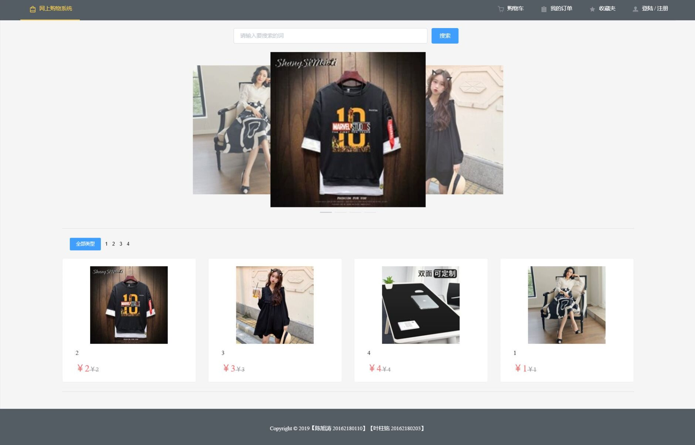

# Webshop
一个基于Vue.js+Node.js+MySQL的[购物网站](https://yezhuming.github.io/Webshop/dist/index.html#/)(因为直接查看没有连接数据库所以没有数据)


## 运行项目
### 克隆项目到本地
新建一个文件夹
```
git clone https://github.com/Yezhuming/Webshop.git
```

### 安装依赖包
```
npm i
```

### 安装服务器端依赖包
进入server文件夹
```
npm i
```

### 启动服务器
```
node server.js
```

### 在开发模式下运行项目
```
npm run serve
```

### 在生产模式下运行项目
```
npm run build
```
